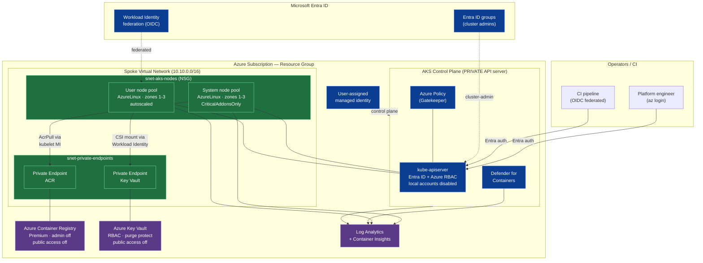

# Secure AKS — Architecture

This POC provisions a security-hardened Azure Kubernetes Service environment
following Microsoft's [AKS best practices](https://learn.microsoft.com/en-us/azure/aks/).

## High-level architecture

## Security controls mapped to AKS best practices

| Area | Control implemented | Best practice reference |
|------|--------------------|------------------------|
| **Authentication** | Microsoft Entra ID integration; local Kubernetes accounts disabled | Cluster security |
| **Authorization** | Azure RBAC for Kubernetes; admin via Entra ID groups only | Cluster security |
| **Identity (control plane)** | User-assigned managed identity (no SP secrets) | Managed identities |
| **Identity (workloads)** | Workload Identity + OIDC issuer (no mounted SA tokens as cloud creds) | Workload Identity |
| **API server exposure** | Private cluster — no public control-plane endpoint | Private clusters |
| **Network dataplane** | Azure CNI Overlay + Cilium network policy (default-deny ready) | Network concepts |
| **Registry** | Premium ACR, admin disabled, public access off, private endpoint, AcrPull via MI | Container image management |
| **Secrets** | Key Vault (RBAC + purge protection) via CSI Secrets Provider with rotation | Secrets / Key Vault |
| **Governance** | Azure Policy add-on (Gatekeeper) for guardrails | Azure Policy for AKS |
| **Threat detection** | Microsoft Defender for Containers | Defender for Containers |
| **Monitoring / audit** | Container Insights + control-plane diagnostic logs (incl. kube-audit) | Monitoring |
| **Node hardening** | Azure Linux OS, host encryption, availability zones, system/user pool split | Node security & upgrades |
| **Patching** | Auto-upgrade channel (stable) + node-image auto-upgrade + maintenance windows | Cluster upgrades |
| **Image hygiene** | Image Cleaner (Eraser) removes vulnerable/unused images | Image cleaner |
| **State security** | Remote backend guidance; state never committed; secrets kept out of git | Operational best practices |

## Traffic & trust flow

1. **Admins/CI authenticate to Entra ID**, receive a token, and are authorized
   by **Azure RBAC**. There is no static admin kubeconfig — `local_account_disabled = true`.
2. The **API server is private**; reach it from a jumpbox in/peered to the VNet
   or via `az aks command invoke`.
3. **Nodes pull images** from ACR over a **private endpoint** using the kubelet
   managed identity's **AcrPull** role — no registry passwords in the cluster.
4. **Workloads read secrets** from Key Vault via the **CSI Secrets Provider**,
   federated through **Workload Identity** — no long-lived credentials.
5. **Defender for Containers**, **Azure Policy**, and **Container Insights**
   continuously assess, enforce, and observe the cluster, shipping to
   **Log Analytics**.

## Hardening beyond this POC (recommended next steps)

- Replace `outbound_type = loadBalancer` with **Azure Firewall + User Defined
  Routing** (or a NAT Gateway) for controlled, inspected egress.
- Add a **hub VNet** with the firewall and a **jumpbox/Bastion** for private
  API access.
- Enforce a **default-deny** `CiliumNetworkPolicy` per namespace.
- Apply **Pod Security Admission** (`restricted`) and specific Azure Policy
  initiatives (e.g. *Kubernetes cluster pod security baseline standards*).
- Enable **private link for Log Analytics** (AMPLS) and customer-managed keys
  (CMK) for ACR, Key Vault, and OS/data disks.
